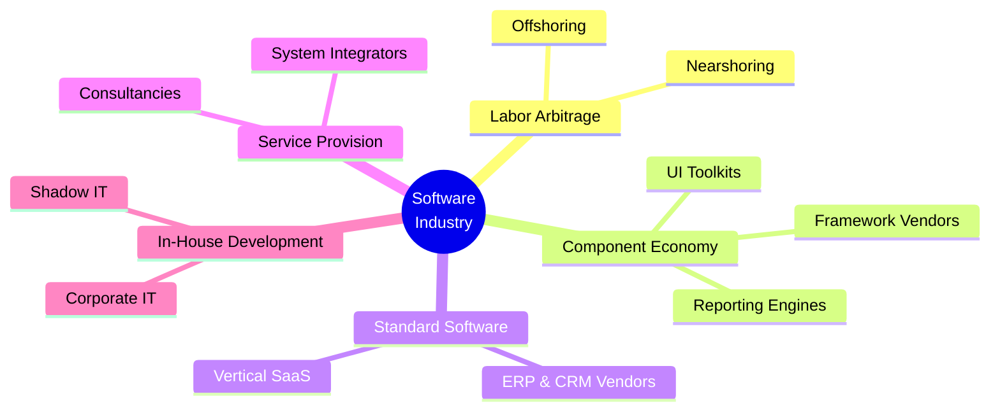
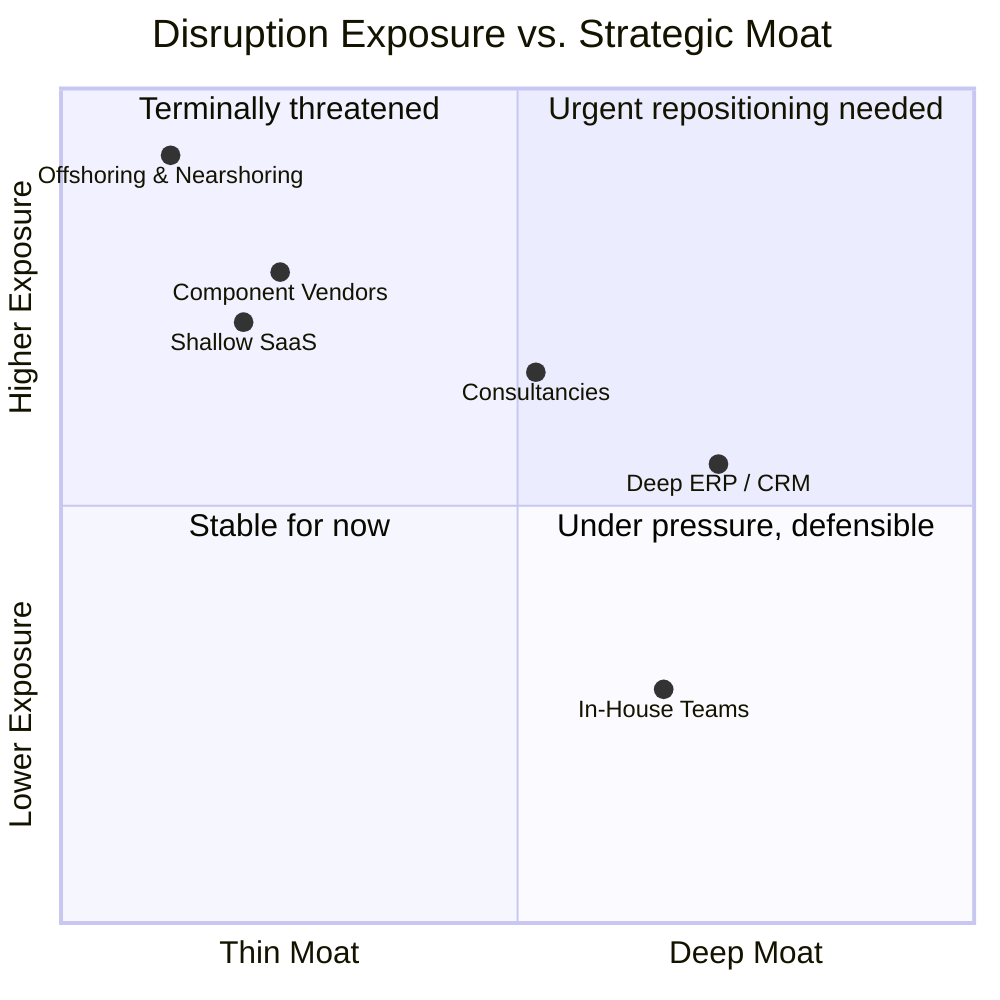

Every conversation about AI and software engineering, irrespectively if I talk to industry professionals or students, eventually narrows to the same question: will AI take my job sooner or later? It's an understandable question, and not an unimportant one. But after talking to several representatives in the last few weeks, I think it's the wrong question to be asking first.

The more urgent question is whether your *employer's business model* survives. Because the pattern that emerges once you look across the software industry is not "developers write less code." It's that **the thing several categories of companies have been selling for decades no longer has a price attached to it**. That's a much bigger problem than a skills gap, and it deserves more serious attention than it's currently getting.

## The value chain, and where it breaks

Software has always had a value chain. Someone writes the requirements, someone builds the thing, someone maintains it, someone bundles reusable pieces so nobody rebuilds the wheel, someone sells a standardized product instead of a custom one, and someone coordinates all of that across borders where labor is cheaper. Every link became a business model.

*The six categories of software business models affected by generative AI — each built on a different link in the production value chain.*

What generative coding tools have done in the last eighteen months is not "make each of these businesses slightly more efficient." It's **remove the reason several of them existed in the first place**. When the cost of producing working software collapses, every business model built on top of scarce production capacity has to answer a question it has never had to answer before: what, exactly, are we charging for now?

Walk through the layers and the same fracture shows up in a different shape each time.

*Strategic positioning of each software business model category. The further upper-left, the more urgent the need to rethink the model.*

## Offshoring and nearshoring: the model that loses its founding argument

Start with the bluntest case. Offshoring and nearshoring businesses were never really selling code. They were selling an **arbitrage on labor cost**, e.g., by offloading development work to low-cost countries such as India, Vietnam, etc., wrapped around a large hidden tax: the overhead of translating requirements across language, timezone, and domain boundaries, then verifying the result on the home side. That overhead was always the real cost of "cheap" offshore development. It just wasn't itemized on the invoice.

Once local developers become dramatically faster and cheaper through AI-assisted coding, the entire justification for absorbing that translation overhead evaporates. There's no longer a large enough cost delta to make the friction worth it. I don't think this is a marginal effect. You can already see it in projects being pulled back onshore because the quality gap combined with the shrinking cost gap no longer is an economic benefit.

The uncomfortable part is what happens to the people on the other end of that arbitrage. Countries with weaker social safety nets absorb the shock of vanishing contracts far more harshly than the market absorbs the efficiency gain. That's a real cost, and it's one almost nobody is pricing into their optimism about AI productivity - at least I am rarely hearing about this impact during my conversations.

## Component and framework vendors: undercut by a general-purpose alternative

Component libraries, UI toolkits, reporting engines, this entire category rested on a simple economic fact: building a mature, well-tested, cross-platform data grid or PDF reporting engine yourself wasn't worth the investment relative to licensing one. **That fact is dissolving.**

When an AI coding assistant can generate a bespoke, purpose-fit component in minutes instead of licensing a general-purpose one for a five-figure annual fee, the calculus flips. You get exactly what you need instead of 5% of a sprawling feature set you're paying to maintain compatibility with. The vendors who see this clearly are already repositioning (e.g., read about commercial impact on [AI on the Tailwind CSS by Adam Wathan](https://github.com/tailwindlabs/tailwindcss.com/pull/2388?ref=ppc.land#issuecomment-3717222957)) away from selling building blocks and toward selling hosted infrastructure, support contracts, and the operational layer that AI-generated code still can't provide on its own. The ones who haven't repositioned yet are the ones quietly not showing their old product on the trade show floor anymore.

## Vibe coding and the standard software vendors

"Vibe coding", a buzzword describing to build working applications with essentially no traditional programming background, just AI-assisted iteration, is easy to dismiss as a toy for small internal tools. I don't think that dismissal survives contact with what's actually happening. People with zero formal training are replacing shop systems, CRM instances, and ERP modules with self-built alternatives, specifically to avoid licensing costs. Of course, AI systems that build fancy websites or prototypes today are limited to build or operate complex software systems and the quality of the resulting code is inconsistent, sometimes genuinely fine, sometimes a mess — but that's a temporary state, not a structural limit - AI systems are getting better in crazy speed.

Standard software vendors selling deep, decades-matured business process logic have a **real moat, at least for now**. Vendors selling comparatively shallow, replaceable functionality do not. The interesting defensive play I'd watch for: standard software vendors building an AI-assisted customization layer directly into their own platform, letting customers vibe-code their own extensions *inside* a governed environment. You keep the maintenance and support relationship instead of losing the customer to a full DIY replacement. That's a genuinely smart move, and I expect to see more of it.

## Service providers: the coding line item disappears, the trust relationship doesn't

For software consultancies, I don't think this is existential, they themselves aren't going away. But the shift underneath them is real. Pure coding capacity used to be a billable line item. It's becoming something clients can partially do themselves. I'm hearing this directly from clients who are service providers: contracts are shrinking, and not mainly because of the economic cycle. Their own customers now have the ability to build solutions in-house and do not see the need to built externally anymore.

What doesn't get commoditized as quickly is different. **Requirements elicitation** from a client who doesn't actually know what they want yet. Deployment and operational ownership. And — this is the one I'd bet on most as a software tester and engineer — **quality assurance**. Generating large amounts of code that looks functional is now easy. Standing behind it, checking that it actually does what it claims, and being the one who is accountable when it doesn't: that is still hard. AI doesn't remove that need. If anything, it makes it worse, because the volume of generated code that needs verifying has gone up by an order of magnitude, while the rigor applied to verifying it mostly hasn't. We will need methods and mechanisms to enforce determinism in a non-deterministic AI world.

## In-house development: the rare beneficiary, with a new risk attached

In-house teams are the one category that comes out ahead, at least directionally. The traditional "make or buy" calculation shifts meaningfully in favor of building, because **the capacity constraint that used to force procurement is loosening**. But this comes bundled with an old problem wearing new clothes: shadow IT.

Departments have always found ways to build unsanctioned tools when official IT capacity couldn't keep up — it just used to top out at an Excel macro. Now it tops out at a fully-featured internal application built end-to-end by someone in the business unit with no engineering background, no deployment plan, no ownership model for what happens when it breaks. The sane middle path: central IT owns and hardens a small number of stable backend services exposed over clean APIs, and business units get to vibe-code their own frontends against that backend inside a governed framework that still enforces deployment standards and code review. You get the speed of decentralized building without losing the operational accountability that centralized IT exists to provide.

## What actually survives across all six

If you line up all six categories and strip out the part that was really just "we have people who can write working code, and that's scarce," what's left is almost always the same thing: **judgment about what to build, accountability for whether it actually works, and the trust relationship** that lets a client or a business unit hand off a problem and know someone competent is answering for the outcome.

That's not a comfortable conclusion if your whole business model rested on production capacity. But I think it's the right one — and it tells you where the defensible value sits for the next several years. Production is getting commoditized. Verification and accountability are not. They're becoming the scarcer resource precisely because production volume is exploding around them.

Most companies in this industry haven't absorbed that yet. Walk a conference floor right now and you'll hear a lot of AI-adjacent messaging — and remarkably little from anyone who has actually rebuilt their pricing or their org chart around this shift. That gap, between how fast the underlying economics are moving and how slowly business strategy is catching up, is the real story. Not "AI writes code now." We've known that for a while. It's that an entire industry's pricing models were quietly built on an assumption that just stopped being true — and most of the companies affected still haven't noticed.
